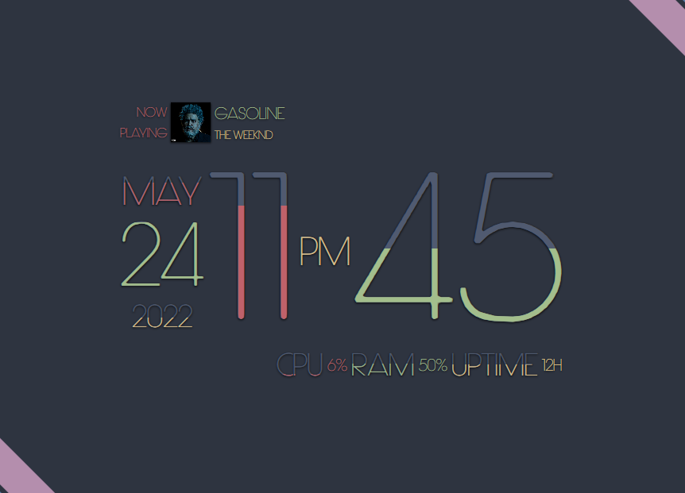

<p align="center">
  <h1 align="center">Aesthetic Clock for KDE Plasma 6+</h1>
  <p align="center">An aesthetic looking clock for KDE with a built-in system monitor and media player! The text "fills up" as the values increase! <br><strong>Ported to KDE Plasma 6.</strong></p>
</p>

<p align="center">
  
</p>

## Compatibility & Overview
This project is a port of the original **Aesthetic Clock** to the **KDE Plasma 6** environment. The original widget relied on legacy Plasma 5 APIs that are deprecated or inefficient in modern KDE. This port rebuilds the widget using native Plasma 6 standards while preserving its signature visual style. 

This project was originally created for personal use and is provided publicly in case it is useful to others.

- **Supported:** Plasma 6.4.5+ (older 6.x versions untested)
- **Original:** [kde_aestheticclock by Prayag2](https://github.com/Prayag2/kde_aestheticclock)

## Features
*   **🕒 Dynamic Fill Animation:** The clock text fills proportionally as time progresses.
*   **📊 System Monitor:** Real-time tracking of CPU, RAM, and System Uptime.
*   **🎵 Media Integration:** Auto-detects players (Spotify, Firefox, etc.) and displays track info.
*   **🎨 High Customization:** Control fonts, colors, spacing, and visibility to match your desktop.

## Port Improvements

*   **Plasma 6 Architecture:** Replaced most deprecated Plasma 5 data sources with modern Plasma 6 APIs for better reliability (still uses `org.kde.plasma.plasma5support` for time data source).
*   **System Monitor:** Updated to the standard `org.kde.ksysguard.sensors` API, replacing the legacy system monitor engine that is no longer used.
*   **Media Integration:** Updated to `Mpris.Mpris2Model` for player detection (Spotify, Firefox, etc.).
*   **Optimizations & Fixes:** Cleaned up time parsing logic, improved color and font/style handling, and fixed configuration menu.
*   **New Options:** Added **Remove Leading Zero** toggle and added an option to **choose a preferred player**.

### Known Issues
- Use system colors is currently disabled.
- Reset to Default colors button may not update the color picker preview correctly, but still applies the correct values.
- MPRIS may not return multiple artists for tracks with multiple artists.

## Installation

### Manual Installation
```bash
# 1. Clone the repository:
git clone https://github.com/ecdevv/plasma-applet-aestheticclock.git

# 2. Copy the widget to your local Plasma folder:
mkdir -p ~/.local/share/plasma/plasmoids/com.github.prayag2.aestheticclock
cp -r plasma-applet-aestheticclock/package/* ~/.local/share/plasma/plasmoids/com.github.prayag2.aestheticclock/

# 3. Restart Plasma (or log out and log back in):
nohup plasmashell --replace &>/dev/null & disown
# or
kquitapp6 plasmashell && kstart5 plasmashell
```

### Via kpackagetool6
```bash
kpackagetool6 -t Plasma/Applet -i plasma-applet-aestheticclock/package
```

### Adding the Widget
Right-click your desktop → **Add Widgets** → search "Aesthetic Clock" → click **+**.

## Credits
- **Original Applet (Plasma 5) by Prayag2:** [kde_aestheticclock](https://github.com/Prayag2/kde_aestheticclock)

## License
This project is licensed under the **GNU General Public License v3.0** (GPLv3). 

The original work by Prayag2 is used under the same license.